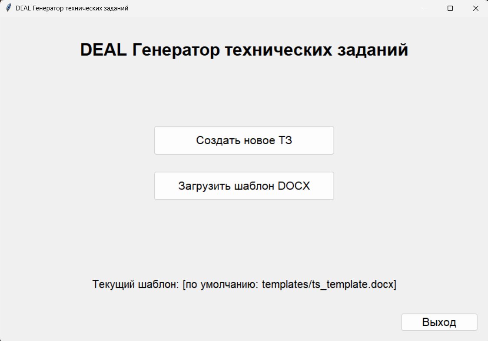
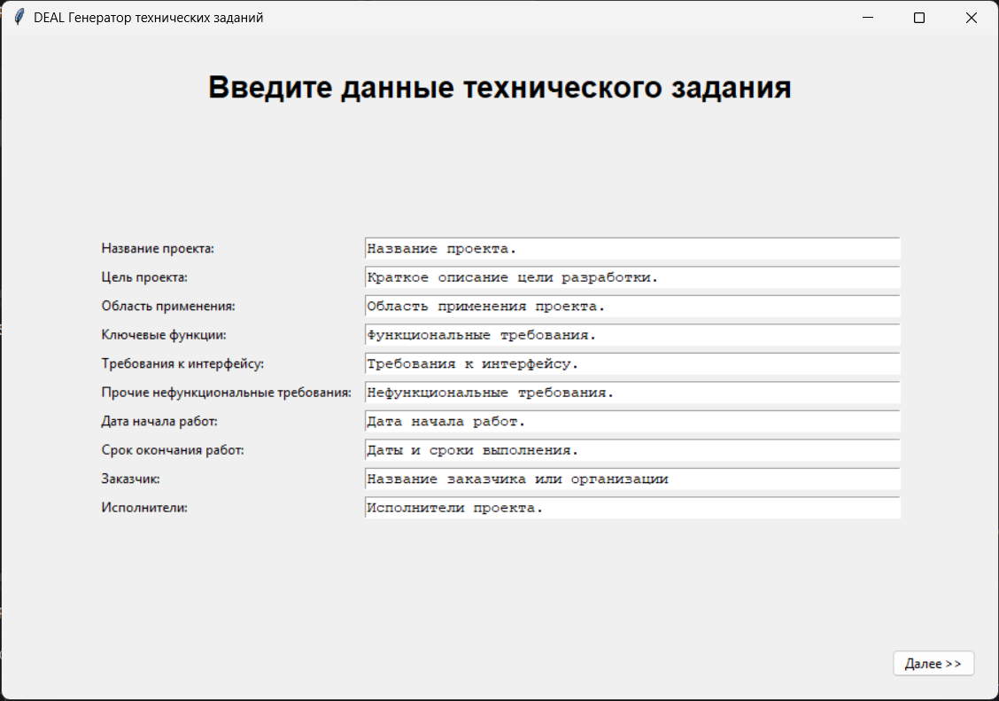
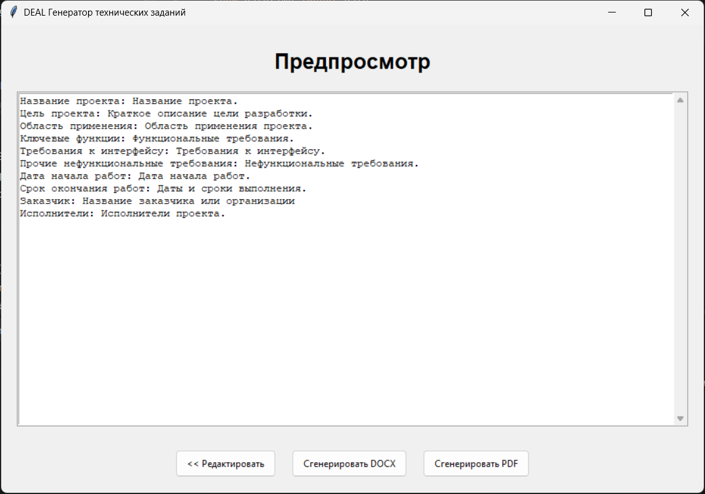

# DEAL — Генератор технических заданий

Приложение для автоматизации процесса создания технических заданий на основе DOCX-шаблонов. Программа предоставляет удобный графический интерфейс, позволяет вводить данные, работать с пользовательскими шаблонами, просматривать документ перед генерацией и экспортировать результат в форматы DOCX и PDF.

## Возможности

- Ввод данных технического задания через готовую форму.
- Поддержка пользовательских DOCX-шаблонов.
- Автоматическая подстановка данных в шаблон
- Предпросмотр введённых данных перед генерацией.
- Экспорт документа в DOCX.
- Экспорт документа в PDF.
- Открытие итоговых файлов и папки результата.
- Поддержка файла типа YAML для предзаполнения формы.

## Технологии и библиотеки

- Python 3.10+
- Tkinter — графический пользовательский интерфейс
- docxtpl — генерация DOCX
- docx2pdf — конвертация DOCX в PDF
- LibreOffice — альтернативный способ конвертации
- PyYAML — чтение файла предзаполнения

## Функциональные экраны приложения

### MainMenuFrame

- Выбор шаблона DOCX
- Переход к созданию нового ТЗ
- Отображение активного шаблона

### FormFrame

- Форма ввода данных (название проекта, цель, сроки, требования и др.)
- Подгрузка значений из prefill.yaml при наличии
- Переход к предпросмотру

### PreviewFrame

- Просмотр введённых данных
- Генерация DOCX
- Генерация PDF
- Возврат к форме для редактирования

### ResultFrame

- Открытие сформированного DOCX
- Открытие PDF
- Переход к папке результата
- Возврат в главное меню

## UML-диаграмма активностей

Отражает последовательность операций, производимых в процессе отработки программы и наглядно демонстрирует алгоритм автоматизации.

## Использование

1. Откройте программу.
2. При необходимости выберите свой DOCX-шаблон.
3. Нажмите Создать новое ТЗ.
4. Заполните форму данными.
5. Просмотрите введённую информацию.
6. Сгенерируйте DOCX или PDF.
7. Откройте файлы либо перейдите в папку output.

## Примечание

Для ещё более эффективной работы с приложением при создании типовых заданий с повторяющиимся данными рекомендуется перезаполнить файл предзаполнения prefill.yaml пользовательскими данными. Тогда данные будут подставляться в форму ввода автоматически, что дополнительно сократит время работы.

### Авторство

Работа является проектом для курсовой работы по дисциплине "Инструментальные средства разработки программного обеспечения с открытым исходным кодом"
Разработчик: Бабейко С.А.

## Лицензия

Проект распространяется под лицезией MIT, с текстом лицензии можно ознакомиться в файле [LICENSE](docs/LICENSE.txt)