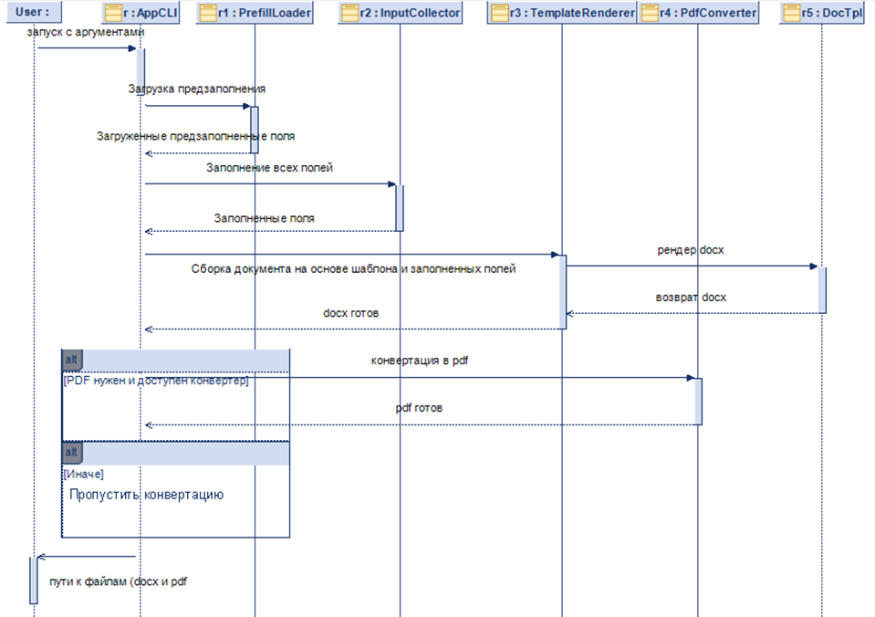
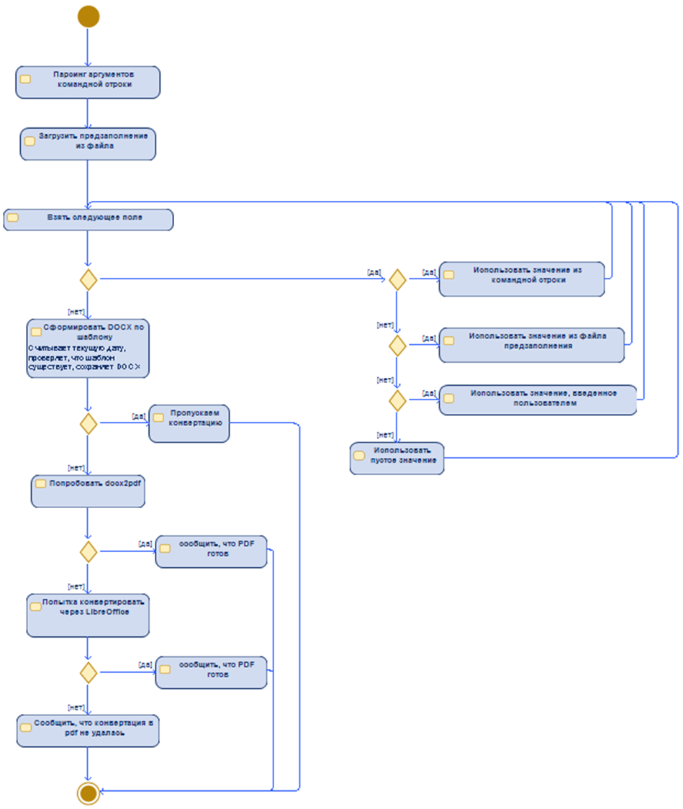

# 1. Описание проекта

DEAL - генератор технических заданий на основе шаблона и минимального ввода со стороны пользователя.

# 2. UML-диаграммы

Для лучшего понимания функционала программы разработаны Диаграмма Последовательностей и Диаграмма Активностей.
Диаграммы хранятся в каталоге [`docs`](docs)

## Диаграммы

Последовательностей

Активностей

# 3. Основные модули проекта
## TzApp

Основа приложения на основе Tkinter, используемая для сборки функциональных экранов и организации грамотной работы приложения. Фиксирует текущее состояние приложения, контролирует создание и вывод фреймов.

## MainMenuFrame

Экран главного меню. Методы:
**on_show** - Обновление подписи о расположении используемого шаблона;
**on_load_template** - Загрузка нового шаблона
**reset_state** - Сброс предыдущего выполнения программы
**on_new_tz** - Создание нового ТЗ

# Новые модули будут добавляться по ходу разработки